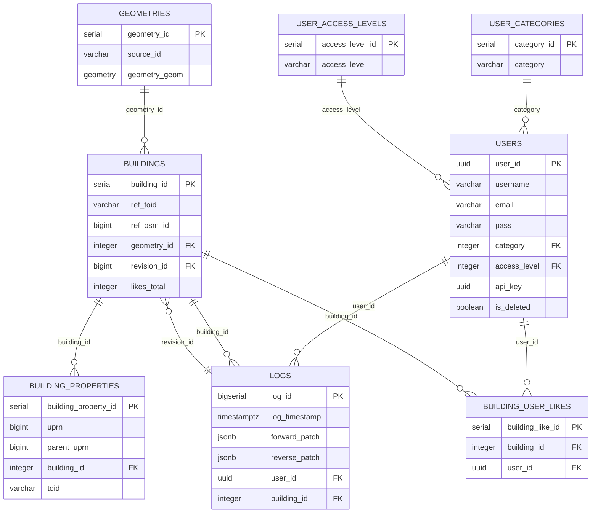

# Colouring Bahrain
[](#contributors)


How many buildings are there in Bahrain? What are their characteristics? Where
are they located and how do they contribute to the city? How adaptable are
they? How long will they last, and what are the environmental and
socio-economic implications of demolition?

[Colouring Bahrain](http://colouring.bh/) is a web-based citizen social
science project designed to help address these questions by crowdsourcing and
visualising twelve categories of information on Bahrain’s buildings.

## Structure

This repository will contain open-source code for the project which:
- stores building footprint polygons and source metadata
- allows site users to record building attribute data
- serves map tiles rendered from collected data
- allows site visitors to download the collected building attribute data

Building attribute data collected as part of the project will be made available
for download under a liberal open data license
([ODbL](https://opendatacommons.org/licenses/odbl/1.0/)).

## Database diagram

The core database stores building geometry and attribute data in PostgreSQL/PostGIS.
The main tables are:
- `geometries`: building footprint polygons and source metadata
- `buildings`: building attributes and references to geometries
- `building_properties`: UPRN/property data linked to buildings
- `logs`: edit history and change tracking
- `building_user_likes`: per-user likes on buildings
- `reference_tables.*`: classification and land-use reference data



## Setup and run

1. Provision database (see `migrations`)
   - Validation: `sudo -u postgres psql -c "SELECT version();"`
   - Validation: `sudo -u postgres psql -c "SELECT PostGIS_Version();"`
1. Load buildings and geometries to database (see `etl`)
   - Validation: `sudo -u postgres psql -d dbname -c "SELECT count(*) FROM buildings;"`
1. Install app dependencies: `cd app && npm i`
   - Validation: `npm --version && node --version && npm ls --depth=0`
1. Run tests: `npm test`
   - Validation: test command passes and returns no failures
1. Run app: `npm start`
   - Validation: `curl -I http://localhost:3000` should return `HTTP/1.1 200 OK`

### Ubuntu 26.04 deployment

For an Ubuntu 26.04 server, install required system packages before running the app:

```bash
sudo apt update
sudo apt install -y git curl build-essential python3 python3-venv python3-dev \
  nodejs npm postgresql postgresql-contrib postgis postgresql-17-postgis-3 \
  libpq-dev libvips-dev
```

Validate the install before continuing:

```bash
python3 --version
node --version
npm --version
sudo -u postgres psql --version
sudo -u postgres psql -c "SELECT PostGIS_Version();"
```

If Ubuntu 26.04 does not provide the right Node.js version, install Node.js from NodeSource:

```bash
curl -fsSL https://deb.nodesource.com/setup_20.x | sudo -E bash -
sudo apt install -y nodejs
```

Validate Node after installation:

```bash
node --version
npm --version
```

Then clone the repository and install the app:

```bash
git clone git@github.com:colouring-cities/colouring-bahrain.git
cd colouring-bahrain/app
npm install
```

Validate app installation:

```bash
npm ls --depth=0
npm test -- --runInBand
```

Create a database and enable PostGIS:

```bash
sudo -u postgres createdb colouring_bahrain
sudo -u postgres psql -d colouring_bahrain -c "CREATE EXTENSION postgis;"
```

Validate the database and extension:

```bash
sudo -u postgres psql -d colouring_bahrain -c "SELECT 1;"
sudo -u postgres psql -d colouring_bahrain -c "SELECT PostGIS_Version();"
```

Copy environment variables and start the app:

```bash
export APP_COOKIE_SECRET=test_secret
export PGHOST=localhost
export PGUSER=postgres
export PGDATABASE=colouring_bahrain
export PGPASSWORD=""
export PGPORT=5432
export TILECACHE_PATH=/path/to/tilecache/directory
npm start
```

Validate the running server:

```bash
curl -I http://localhost:3000
```

For production use, run the built server:

```bash
cd app
npm run build
NODE_ENV=production node build/server.js
```

Validate the production build:

```bash
node -e "require('./build/server'); console.log('build ok');"
```

In development, run with environment variables:

```bash
APP_COOKIE_SECRET=test_secret \
PGHOST=localhost \
PGUSER=dbuser \
PGDATABASE=dbname \
PGPASSWORD=dbpassword \
PGPORT=5432 \
TILECACHE_PATH=/path/to/tilecache/directory \
    npm start
```

## Acknowledgements

Colouring Bahrain was set up at the Centre for Advanced Spatial
Analysis (CASA), University of Bahrain and is now based at The Alan Turing Institute.
Ordnance Survey is providing building footprints required to collect the data,
facilitated by the Greater Bahrain Authority (GLA), and giving access to its API
and technical support.

## License

    Colouring Bahrain
    Copyright (C) 2018 Tom Russell and Colouring Bahrain contributors

    This program is free software: you can redistribute it and/or modify
    it under the terms of the GNU General Public License as published by
    the Free Software Foundation, either version 3 of the License, or
    (at your option) any later version.

    This program is distributed in the hope that it will be useful,
    but WITHOUT ANY WARRANTY; without even the implied warranty of
    MERCHANTABILITY or FITNESS FOR A PARTICULAR PURPOSE.  See the
    GNU General Public License for more details.

    You should have received a copy of the GNU General Public License
    along with this program. If not, see <http://www.gnu.org/licenses/>.

## Contributors

Thanks goes to these wonderful people ([emoji key](https://github.com/all-contributors/all-contributors#emoji-key)):

<!-- ALL-CONTRIBUTORS-LIST:START - Do not remove or modify this section -->
<!-- prettier-ignore -->
<table>
  <tr>
    <td align="center"><a href="https://github.com/polly64"><br /><sub><b>polly64</b></sub></a><br /><a href="#design-polly64" title="Design">🎨</a> <a href="#ideas-polly64" title="Ideas, Planning, & Feedback">🤔</a> <a href="#content-polly64" title="Content">🖋</a> <a href="#fundingFinding-polly64" title="Funding Finding">🔍</a></td>
    <td align="center"><a href="https://github.com/tomalrussell"><br /><sub><b>Tom Russell</b></sub></a><br /><a href="#design-tomalrussell" title="Design">🎨</a> <a href="#ideas-tomalrussell" title="Ideas, Planning, & Feedback">🤔</a> <a href="https://github.com/tomalrussell/colouring-Bahrain/commits?author=tomalrussell" title="Code">💻</a> <a href="https://github.com/tomalrussell/colouring-Bahrain/commits?author=tomalrussell" title="Documentation">📖</a></td>
    <td align="center"><a href="https://dghumphrey.co.uk/"><br /><sub><b>dominic</b></sub></a><br /><a href="#ideas-dominijk" title="Ideas, Planning, & Feedback">🤔</a> <a href="#content-dominijk" title="Content">🖋</a></td>
    <td align="center"><a href="https://github.com/adamdennett"><br /><sub><b>Adam Dennett</b></sub></a><br /><a href="#ideas-adamdennett" title="Ideas, Planning, & Feedback">🤔</a></td>
    <td align="center"><a href="https://github.com/duncan2001"><br /><sub><b>Duncan Smith</b></sub></a><br /><a href="#ideas-duncan2001" title="Ideas, Planning, & Feedback">🤔</a></td>
    <td align="center"><a href="https://github.com/martin-dj"><br /><sub><b>martin-dj</b></sub></a><br /><a href="https://github.com/tomalrussell/colouring-Bahrain/commits?author=martin-dj" title="Code">💻</a></td>
    <td align="center"><a href="https://github.com/mz8i"><br /><sub><b>mz8i</b></sub></a><br /><a href="https://github.com/tomalrussell/colouring-Bahrain/commits?author=mz8i" title="Code">💻</a> <a href="#ideas-mz8i" title="Ideas, Planning, & Feedback">🤔</a></td>
  </tr>
</table>

<!-- ALL-CONTRIBUTORS-LIST:END -->

This project follows the [all-contributors](https://github.com/all-contributors/all-contributors) specification. Contributions of any kind welcome!

Even more thanks go to Colouring Bahrain contributors, funders, project partners, consultees,
advisers, supporters and friends - [everyone involved in the
project](https://www.pages.colouring.bh/whoisinvolved).
